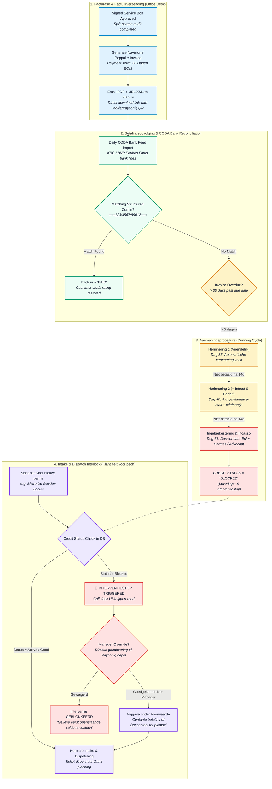

# Bossuyt Field Service ERP — Finance, Credit Control, Weekend Service & Executive KPIs

**Document Reference:** `docs/superpowers/BOSSUYT-ERP-FINANCE-MANAGEMENT-WEEKEND-SPEC.md`  
**Target Enterprise:** Bossuyt Grootkeuken NV (Industrial Kitchen & Laundry Field Service, Belgium)  
**Design Standard:** Bossuyt Service Design System (Tailwind CSS, Brand Tokens `#2F343A`, `#F28C28`, `#2E9E5B`, `#D64545`, `#4C6A85`)  
**Target Stack:** Next.js 16 (App Router), React 19, PostgreSQL 16 (Drizzle ORM), TypeScript 5.8  

---

## 1. End-to-End Extended Service Lifecycles (Interactive Diagrams)

### 1.1 Invoicing, Payment Tracking & Bad Payer Credit Block Flow

This diagram illustrates how an approved service intervention flows into invoicing, monitors payment terms (30 days end of month), initiates progressive dunning, and dynamically enforces an **Interventiestop (Credit Block)** at the moment of intake.



---

### 1.2 Technician Weekend On-Call Service Flow (Wachtdienst / 24/7 Permanence)

This diagram details the weekend service workflow under Belgian joint industrial committee rules (**PC 111 - Metaal & Techniek**), covering dispatch out of hours, customer surcharge acceptance, and weekend rate validation.

```mermaid
flowchart TD
    %% Styling
    classDef client fill:#fef3c7,stroke:#d97706,stroke-width:2px,color:#0f172a;
    classDef standby fill:#e0f2fe,stroke:#0284c7,stroke-width:2px,color:#0f172a;
    classDef tech fill:#ecfdf5,stroke:#059669,stroke-width:2px,color:#0f172a;
    classDef cert fill:#fee2e2,stroke:#dc2626,stroke-width:2px,color:#0f172a;
    classDef finance fill:#ede9fe,stroke:#7c3aed,stroke-width:2px,color:#0f172a;

    subgraph WEEKEND_INTAKE["1. Weekend Noodcentrale (Zaterdag / Zondag)"]
        W1["Weekend Noodoproep<br/><i>Zaterdag 18:30: Koelcel traiteur valt uit</i>"]:::client
        W2["Triage & Klantstatus Check<br/><i>Actief onderhoudscontract? Wanbetaler?</i>"]:::standby
        W3{"Akkoord Weekendtarief?<br/><i>Forfait €135 + 150% (Za) / 200% (Zo)</i>"}:::client
        W4["Oproep Afgeblazen<br/><i>Klant wacht tot maandag 08:00</i>"]:::client
        W5["SMS / Link Digitale Bevestiging<br/><i>Klant accepteert toeslag digitaal</i>"]:::standby

        W1 --> W2 --> W3
        W3 -- "Niet akkoord" --> W4
        W3 -- "Akkoord gegeven" --> W5
    end

    subgraph STANDBY_DISPATCH["2. Wachtdienst Dispatching"]
        W6["Identificeer Technieker van Wacht<br/><i>Rotatieschema: Thomas M. (Bus 22)</i>"]:::standby
        W7{"Skill Validatie:<br/><i>Koelcertificaat Cat. 1 aanwezig?</i>"}:::cert
        W8["Push Alert naar Mobiel van Wacht<br/><i>Hoge prioriteit geluidssignaal</i>"]:::tech
        W9["Technieker Accepteert Oproep<br/><i>ETA 35 min wordt teruggestuurd</i>"]:::tech

        W5 --> W6 --> W7
        W7 -- "Gecertificeerd" --> W8 --> W9
    end

    subgraph ON_SITE_EXECUTION["3. Uitvoering Ter Plaatse"]
        W10["Technieker Vertrekt van Thuis<br/><i>Start reistijd & standby mobilisatie</i>"]:::tech
        W11["Aankomst & Diagnostiek<br/><i>Tijdstempel GPS geregistreerd</i>"]:::tech
        W12["Noodherstelling Uitgevoerd<br/><i>Vervangt magneetschakelaar uit koffer</i>"]:::tech
        W13["Digitale Werkbon Opmaken<br/><i>Tarief 'Weekend 150%' automatisch vergrendeld</i>"]:::tech
        W14["Handtekening Klant voor Akkoord<br/><i>Inclusief weekendtoeslag bevestiging</i>"]:::tech

        W9 --> W10 --> W11 --> W12 --> W13 --> W14
    end

    subgraph PAYROLL_FINANCE["4. Verloning (PC 111) & Facturatie"]
        W15["Payroll Audit (Sociaal Secretariaat)<br/><i>Standby vergoeding + 150%/200% overuren</i>"]:::finance
        W16["Facturatie Audit Desk<br/><i>Verificatie weekendtarief (Regel V3)</i>"]:::finance
        W17["Export naar Navision & Dimona<br/><i>Garantie correcte loonfiche & factuur</i>"]:::finance

        W14 --> W15
        W14 --> W16 --> W17
    end
```



---

## 2. Realistic Belgian Business Scenarios

### Scenario D: The Blocked Debtor Triage (Bistro De Gouden Leeuw)
* **Customer Profile:** *Bistro De Gouden Leeuw BVBA*, Zeedijk 44, 8370 Blankenberge (Klant L: `K04192`, Klant F: `K04192`).
* **Financial Background:**
  * Invoice `FAC-2026-0812` (€ 1.840,00 - Onderhoud dampkap & gasinstallatie) is 68 dagen vervallen.
  * Reminder 1 sent on Day 35, Reminder 2 on Day 50.
  * On Day 65, Finance Flagged credit status: `credit_status = 'blocked'`.
* **The Incident (Friday 16:45):**
  * The restaurant owner calls in panic: *"Our main Hobart dishwashing machine is throwing Error 04 and refusing to drain right before our busy Friday evening service."*
* **Call Desk Behavior (Intake Clerk Anouk):**
  1. Anouk types `De Gouden Leeuw` into `CustomerSelect`.
  2. The input border immediately flashes intense crimson (`#D64545`), accompanied by a modal alert:
     > **⚠️ OPGELET: KLANT GEBLOKKEERD (LEVERINGS- & INTERVENTIESTOP)**  
     > **Openstaand Saldo:** € 1.840,00 (Vervaldatum: 03/07/2026 - 68 dagen vervallen)  
     > **Status:** Dossier overgemaakt aan incassopartner.  
     > **Actie:** Geen interventie inplannen zonder schriftelijk akkoord directie of onmiddellijke betaling.
  3. Anouk explains: *"Mijnheer, wegens het openstaande saldo van factuur 0812 kunnen wij momenteel geen technicus sturen. Indien u nu via Payconiq of instant bankoverschrijving betaalt, kan onze manager het dossier direct deblokkeren."*
* **Resolution Path:**
  * The owner pays € 1.840,00 via Payconiq QR link sent to his smartphone.
  * Management unlocks the stop (`override_credit_block: true`, Reason: *Instant payment receipt confirmed by KBC*).
  * Intervention `TKT-915` is dispatched as warm/urgent.

---

### Scenario E: Sunday Night Blast Chiller Failure (Traiteur Depuydt)
* **Customer Profile:** *Feestzalen & Traiteur Depuydt NV*, Brugsesteenweg 110, 8520 Kuurne (Klant L: `K00219`).
* **Contract Level:** Omnium Onderhoudscontract met 24/7 Weekend Wachtdienstgarantie.
* **The Incident (Sunday 21:15):**
  * 300kg of prepared beef tenderloin for a corporate banquet is loaded in the blast chiller (*Gram Roll-In Shock Freezer*).
  * High-pressure fault trips the cooling pack; temperature is rising rapidly (+4°C to +12°C).
* **The Weekend Wachtdienst Execution:**
  1. **Automated Escalation:** Night call connects to Thomas M. (Technician on duty, certified F-gas category 1).
  2. **App Notification:** The Bossuyt PWA emits a persistent high-priority audio alert.
  3. **Triage & Route:** Thomas inspects device history on his mobile device. The system confirms an active 24/7 SLA contract (`isContractCovered = true` -> no initial weekend dispatch fee charged to customer).
  4. **Execution:**
     * Thomas arrives on-site at 21:55.
     * Identifies a clogged condenser fan motor. Replaces the universal axial fan from his van emergency stock (`partSource: 'van_stock'`).
     * Machine starts chilling down at 22:40.
  5. **Bon Sign-Off:**
     * App displays **Weekend Tarief (Zondag 200%)**.
     * Work duration: 50 min. Travel: 30 min.
     * Chef signs on screen.
  6. **HR & Payroll Integration:**
     * Thomas receives 4 hours guaranteed standby callout pay + 200% hourly rate according to **PC 111 CAO**.
     * Next morning at 07:00, Kuurne warehouse receives an urgent bin replenishment task for 1× axial fan to restore Thomas's Sunday van kit.

---

### Scenario F: Executive Monthly Operations & Efficiency Review
* **Participants:** Managing Director (Lieven Bossuyt) and Service Operations Manager.
* **Tool:** Bossuyt ERP Executive KPI Cockpit (`/admin/kpi`).
* **Evaluation Metrics Analyzed:**
  1. **First-Time-Fix (FTF) Rate:** Rose from 81.1% to 84.2% following the implementation of L-01/L-02 fixes (eliminating missing parts on follow-up revisits).
  2. **Technician Productivity Matrix:**
     * *Bart V.:* 88% billable hours (7.0h/day average), 12% travel. High margin on combi-steamer repairs.
     * *Kevin D.:* 74% billable hours, 26% travel. Analysis reveals Kevin is being dispatched across both East and West Flanders without clustering.
     * *Action:* Dispatcher instructed to enforce regional grouping on Tuesday/Thursday for Gent vs Brugge.
  3. **Days Sales Outstanding (DSO):**
     * Dropped from 54 days to 36 days after launching the automated dunning cycle and instant Payconiq links on invoices.
  4. **Van Stock Accuracy:**
     * 98.2% bin match rate since warehouse aisle barcode scanning was deployed. Zero phantom purchases detected this month.

---

## 3. UI/UX Mockups in Bossuyt Website Design System

The mockups below are styled according to the existing Bossuyt front-end tokens (`@theme` in `app/globals.css`):
* Backgrounds: `bg-[#2F343A]` (Dark Brand Headers), `bg-[#F4F6F8]` (Surface Gray)
* Borders: `border-[#E5E7EB]` (Stroke)
* Primary Accents: `bg-[#F28C28]` (Brand Orange), `text-[#2E9E5B]` (Brand Green), `text-[#D64545]` (Brand Red), `bg-[#4C6A85]` (Brand Blue)

### 3.1 Bad Payer / Debiteurenbeheer & Credit Block Desk (`/facturatie/debiteuren`)

```
┌───────────────────────────────────────────────────────────────────────────────────────────────────────────────────────────────────────────┐
│  bossuyt  [Facturatie ▼]   DEBITEURENBEHEER & KREDIETSTATUS                      Totaal Openstaand: € 48.250  |  Vervallen: € 14.120      │
├───────────────────────────────────────────────────────────────────────────────────────────────────────────────────────────────────────────┤
│ [🔍 Zoek klant, BTW...]  Filter: [Alle Wanbetalers ▼]   Sorteer: [Vervaldagen (Hoog-Laag) ▼]                [+ Export Incassodossiers]   │
├───────────────────────────────────────────────────────────────────────────────────────────────────────────────────────────────────────────┤
│ 🔴 GEBLOKKEERDE KLANTEN (LEVERINGS- & INTERVENTIESTOP)                                                                                    │
├───────────────────────────────────────────────────────────────────────────────────────────────────────────────────────────────────────────┤
│ • Bistro De Gouden Leeuw BVBA (K04192) · Blankenberge                                                                                     │
│   Openstaand: € 1.840,00  ·  Oudste factuur: 68 dagen vervallen (FAC-2026-0812)                                                          │
│   Status: [🔴 GEBLOKKEERD]  ·  Laatste actie: Aangetekend schrijven (01/09)                                                               │
│   Opmerking: Geen interventies plannen. Zaakvoerder reageert niet op herinneringen.                                                        │
│   [Deblokkeer Tijdelijk (Manager Override)]   [Betaaluitnodiging SMS]   [Dossier Inkijken]                                               │
│ ───────────────────────────────────────────────────────────────────────────────────────────────────────────────────────────────────────── │
│ • Hotel Du Phare NV (K01104) · Oostende                                                                                                   │
│   Openstaand: € 3.420,50  ·  Oudste factuur: 62 dagen vervallen (FAC-2026-0790)                                                          │
│   Status: [🔴 GEBLOKKEERD]  ·  Laatste actie: Ingebrekestelling verzonden                                                                 │
│   Opmerking: Belooft betaling sinds 15 augustus. Directie overleg nodig.                                                                  │
│   [Deblokkeer Tijdelijk (Manager Override)]   [Betaaluitnodiging SMS]   [Dossier Inkijken]                                               │
├───────────────────────────────────────────────────────────────────────────────────────────────────────────────────────────────────────────┤
│ 🟡 IN AANMANINGSCYCLUS (RISICOKLANTEN)                                                                                                    │
├───────────────────────────────────────────────────────────────────────────────────────────────────────────────────────────────────────────┤
│ • Brasserie Het Molenhof (K03310) · Roeselare                                                                                             │
│   Openstaand: € 640,00  ·  Vervallen: 42 dagen (FAC-2026-0888)  ·  Status: [Herinnering 2 Verzonden]                                     │
│   [Verzend Herinnering 3]   [Interventiestop Activeren]                                                                                  │
│ ───────────────────────────────────────────────────────────────────────────────────────────────────────────────────────────────────────── │
│ • Restaurant De Karmeliet (K00109) · Brugge                                                                                              │
│   Openstaand: € 1.120,00  ·  Vervallen: 36 dagen (FAC-2026-0901)  ·  Status: [Herinnering 1 Verzonden]                                     │
│   [Verzend Herinnering 2]   [Klant Contact Gegevens]                                                                                     │
└───────────────────────────────────────────────────────────────────────────────────────────────────────────────────────────────────────────┘
```

---

### 3.2 Technician Weekend Standby Flow (Mobile PWA View — `/wachtdienst`)

```
┌────────────────────────────────────────┐
│ bossuyt wachtdienst        [⚡ ACTIEF] │
├────────────────────────────────────────┤
│ 👤 Thomas M. (Bus 22)                  │
│ Wachtdienst: Vrij 17:00 - Maan 08:00   │
│ Certificaten: [Cat.1 F-Gas] [Cerga Gas]│
├────────────────────────────────────────┤
│ 🚨 URGENTE NOODOPROEP TER PLAATSE      │
├────────────────────────────────────────┤
│ Klant: Traiteur Depuydt NV             │
│ Adres: Brugsesteenweg 110, Kuurne      │
│ Toestel: Gram Roll-In Shock Freezer    │
│ Melding: Koelgroep valt stil, alarm HP │
├────────────────────────────────────────┤
│ 💶 TARIEFAKKOORD                       │
│ Status: Omnium Contract (Geen toeslag) │
│ Toepassing: [Zondag 200% Arbeid]       │
│ Klant Handtekening Vooraf: [✓ AKKOORD] │
├────────────────────────────────────────┤
│ ONDERDELEN CHECK (NOODKIT BUS 22):     │
│ [✓] 1× Condensor Ventilator 230V       │
│ [✓] 1× Pressostaat Danfoss KP15        │
│ [✓] 1× Fles Koelgas R452A (8.2kg)      │
├────────────────────────────────────────┤
│ [ 🚗 START ROUTE (Waze / Maps) ]       │
│ [ 📞 Bel Chef Depuydt (+32 475 ...) ]  │
│ [ 📋 Open Digitale Weekend Werkbon ]   │
└────────────────────────────────────────┘
```

---

### 3.3 Executive Management Cockpit & Efficiency Overview (`/admin/kpi`)

```
┌───────────────────────────────────────────────────────────────────────────────────────────────────────────────────────────────────────────┐
│  bossuyt  [Beheer ▼]   MANAGEMENT COCKPIT & RENDEMENT                                                   Periode: [September 2026 ▼]       │
├───────────────────────────────────┬───────────────────────────────────┬───────────────────────────────────┬───────────────────────────────┤
│ BEDRIJFSRENDEMENT SERVICE         │ TECHNIEKER PRODUCTIVITEIT         │ FIRST-TIME-FIX (FTF)              │ AVERAGE DAYS SALES OUTST.     │
│ € 184.290  ▲ +8.4% (vs aug)       │ 82.4% Factureerbare Uren          │ 84.2%  (Target: ≥ 85%)            │ 36.4 Dagen  ▼ -12d (Doel <35) │
├───────────────────────────────────┴───────────────────────────────────┴───────────────────────────────────┴───────────────────────────────┤
│ INDIVIDUEEL TECHNIEKER DASHBOARD & EFFICIËNTIE                                                                                            │
├───────────────────────┬───────────────┬───────────────────┬───────────────────┬───────────────────┬───────────────────┬───────────────────┤
│ TECHNIEKER            │ JOBS VOLTOOID │ PRODUCTIEVE UREN  │ FACTUREERBAAR %   │ RIJTIJD GEMIDDELD │ FIRST-TIME-FIX    │ OMZET MATERIALEN  │
├───────────────────────┼───────────────┼───────────────────┼───────────────────┼───────────────────┼───────────────────┼───────────────────┤
│ Bart V. (Bus 14)      │ 42 jobs       │ 148 uur           │ 88.2% (Groen)     │ 19 min / job      │ 89.5% (Uitstekend)│ € 12.450          │
│ Kevin D. (Bus 09)     │ 34 jobs       │ 139 uur           │ 74.1% (Oranje)    │ 36 min / job (⚠️) │ 78.4% (Aandacht)  │ €  8.920          │
│ Thomas M. (Bus 22)    │ 38 jobs       │ 144 uur           │ 84.6% (Groen)     │ 22 min / job      │ 86.8% (Goed)      │ € 14.180          │
│ Luc P. (Bus 08)       │ 40 jobs       │ 142 uur           │ 83.0% (Groen)     │ 24 min / job      │ 82.5% (Goed)      │ € 10.340          │
├───────────────────────┴───────────────┴───────────────────┴───────────────────┴───────────────────┴───────────────────┴───────────────────┤
│ AFDELING OVERZICHT: LOGISTIEK, PLANNING & FACTURATIE                                                                                      │
├───────────────────────────────────────────────────┬───────────────────────────────────────────────────┬───────────────────────────────────┤
│ 📦 MAGAZIJN & VOORRAAD                            │ 📅 PLANNING & DISPATCH                            │ 💶 FACTURATIE DOORLOOPTIJD        │
│ • Stockwaarde in bussen: € 64.200                 │ • Ongeplande wachttijd urgent: 1.4 uur            │ • Werkbon getekend -> Factuur:    │
│ • Van stock accuraatheid: 98.2%                   │ • Route efficiëntie index: 91.4%                  │   1.2 werkdagen (Target: < 2.0)   │
│ • Openstaande bestelorders: 6 (€ 4.120)           │ • Gemiste SLA afspraken: 0 (0.0%)                 │ • Betwiste facturen: 1.8%         │
└───────────────────────────────────────────────────┴───────────────────────────────────────────────────┴───────────────────────────────────┘
```

---

## 4. Database Schema Extensions (Drizzle ORM)

Below is the exact TypeScript implementation to add to [`lib/db/schema.ts`](file:///mnt/data/bossuyt_service_next_staging/lib/db/schema.ts) to support debt tracking, credit blocks, weekend standby duties, and individual performance tracking:

```typescript
import { pgTable, text, timestamp, boolean, integer, numeric, pgEnum, primaryKey } from 'drizzle-orm/pg-core'

// ── Credit & Bad Payer Enums ────────────────────────────────────────────────
export const creditStatusEnum = pgEnum('customer_credit_status', [
  'good',              // Normal customer, healthy credit
  'watch_list',        // 1 overdue invoice, warning shown
  'reminder_sent',     // In automated dunning cycle
  'blocked',           // Credit block: NO DISPATCH without manager override
  'legal_collection',  // Dossier handed to debt agency / lawyer
])

export const invoicePaymentStatusEnum = pgEnum('invoice_payment_status', [
  'draft',
  'sent',
  'reminded_1',
  'reminded_2',
  'reminded_3',
  'paid',
  'disputed',
  'uncollectible',
])

// ── Invoices Ledger Table ───────────────────────────────────────────────────
export const customerInvoices = pgTable('customer_invoices', {
  id: text('id').primaryKey(), // e.g. 'FAC-2026-0812'
  workOrderId: text('work_order_id'),
  customerFId: text('customer_f_id').notNull(),
  invoiceDate: timestamp('invoice_date', { withTimezone: true }).notNull(),
  dueDate: timestamp('due_date', { withTimezone: true }).notNull(),
  totalExclVat: numeric('total_excl_vat', { precision: 10, scale: 2 }).notNull(),
  totalInclVat: numeric('total_incl_vat', { precision: 10, scale: 2 }).notNull(),
  paidAmount: numeric('paid_amount', { precision: 10, scale: 2 }).default('0.00').notNull(),
  status: invoicePaymentStatusEnum('status').default('sent').notNull(),
  dunningLevel: integer('dunning_level').default(0).notNull(),
  peppolMessageId: text('peppol_message_id'),
  codaMatchId: text('coda_match_id'),
  updatedAt: timestamp('updated_at', { withTimezone: true }).defaultNow().notNull(),
})

// ── Customer Credit Profile Extensions ──────────────────────────────────────
export const customerCreditProfiles = pgTable('customer_credit_profiles', {
  customerFId: text('customer_f_id').primaryKey(),
  creditStatus: creditStatusEnum('credit_status').default('good').notNull(),
  totalOverdueBalance: numeric('total_overdue_balance', { precision: 10, scale: 2 }).default('0.00').notNull(),
  creditLimit: numeric('credit_limit', { precision: 10, scale: 2 }).default('5000.00').notNull(),
  blockReason: text('block_reason'),
  overrideApprovedBy: text('override_approved_by'),
  overrideApprovedUntil: timestamp('override_approved_until', { withTimezone: true }),
  updatedAt: timestamp('updated_at', { withTimezone: true }).defaultNow().notNull(),
})

// ── Weekend On-Call Standby (Wachtdienst) Schedule ──────────────────────────
export const standbyShifts = pgTable('standby_shifts', {
  id: text('id').primaryKey(),
  technicianId: text('technician_id').notNull(),
  startDatetime: timestamp('start_datetime', { withTimezone: true }).notNull(), // Friday 17:00
  endDatetime: timestamp('end_datetime', { withTimezone: true }).notNull(),     // Monday 08:00
  isLeadOnCall: boolean('is_lead_on_call').default(true).notNull(),
  standbyAllowanceEur: numeric('standby_allowance_eur', { precision: 8, scale: 2 }).default('150.00').notNull(),
  notes: text('notes'),
})

// ── Technician Performance Ledger (Daily Aggregations for KPIs) ─────────────
export const technicianDailyMetrics = pgTable('technician_daily_metrics', {
  technicianId: text('technician_id').notNull(),
  metricDate: text('metric_date').notNull(), // 'YYYY-MM-DD'
  jobsCompleted: integer('jobs_completed').default(0).notNull(),
  firstTimeFixCount: integer('first_time_fix_count').default(0).notNull(),
  totalLaborMinutes: integer('total_labor_minutes').default(0).notNull(),
  billableLaborMinutes: integer('billable_labor_minutes').default(0).notNull(),
  travelMinutes: integer('travel_minutes').default(0).notNull(),
  travelKilometers: integer('travel_kilometers').default(0).notNull(),
  materialRevenueEur: numeric('material_revenue_eur', { precision: 10, scale: 2 }).default('0.00').notNull(),
  weekendHoursMinutes: integer('weekend_hours_minutes').default(0).notNull(),
}, (table) => ({
  pk: primaryKey({ columns: [table.technicianId, table.metricDate] }),
}))
```

---

## 5. UI Generation Prompts for Copilot, Claude & Agy

To generate the exact React 19 + Tailwind CSS v4 code components matching the existing application, use the following structured prompts:

### Prompt 1: Bad Payer Credit Block & Dunning Desk
```text
Act as a senior frontend engineer building an ERP module for Bossuyt Grootkeuken NV using Next.js 16 (App Router), React 19, and Tailwind CSS v4.
Create the page component `app/(dashboard)/facturatie/debiteuren/page.tsx` adhering to the brand colors defined in globals.css:
- Brand dark: #2F343A (header/dark cards)
- Brand orange: #F28C28 (CTAs, warning highlights)
- Brand red: #D64545 (blocked customers, severe alerts)
- Brand green: #2E9E5B (paid status, success badges)
- Surface background: #F4F6F8
Requirements:
1. Header bar showing total outstanding debt and total overdue debt (> 30 days).
2. Filter toggle for 'Alle Wanbetalers', 'Geblokkeerd (Stop)', 'In Aanmaning'.
3. Customer list displaying:
   - Klant name, location, and authoritative ID (K0...).
   - Overdue amount, days overdue, and current dunning stage (Herinnering 1/2/Ingebrekestelling).
   - Prominent badge showing if the customer has an active 'INTERVENTIESTOP'.
   - Action buttons: 'Deblokkeer Tijdelijk (Manager Override)', 'Verzend Betaallink SMS', 'Bekijk Dossier'.
4. Include a modal for Manager Override requiring a mandatory rationale and secret PIN code.
5. All texts in Belgian Dutch (nl-BE).
```

### Prompt 2: Weekend Wachtdienst Mobile Interface
```text
Act as a senior React/Tailwind engineer building a mobile-first PWA view for Bossuyt service technicians on weekend standby duty: `app/wachtdienst/page.tsx`.
Theme: Mobile optimized (viewport max-w-md mx-auto), using brand colors #2F343A (header), #D64545 (emergency red badge), #F28C28 (primary actions), #2E9E5B (certifications).
Requirements:
1. Status pill showing 'Wachtdienst Actief' with shift window (Vrijdag 17:00 - Maandag 08:00) and verified technician certifications (Cerga Gas, F-Gas).
2. Incoming emergency job card showing:
   - High-urgency pulse animation.
   - Customer name, site address, and reported critical problem.
   - Surcharge verification banner: confirms customer has agreed to the weekend surcharge (150% Saturday or 200% Sunday).
   - Van inventory checklist confirming emergency parts are present in the van.
3. Quick actions: 'Start Navigatie' (launches native maps), 'Bel Klant', and 'Start Weekend Werkbon'.
4. Full offline support via IndexedDB cache.
```

### Prompt 3: Executive Management KPI & Efficiency Cockpit
```text
Act as a lead fullstack engineer designing the executive dashboard `app/(dashboard)/admin/kpi/page.tsx` for Bossuyt Grootkeuken NV.
Requirements:
1. Top KPI metric cards:
   - Overall Service Revenue (with month-over-month trend).
   - Team Billable Hours Ratio (% of total hours that are invoiced, target >= 80%).
   - First-Time-Fix Rate (% of jobs completed without a revisit, target >= 85%).
   - Days Sales Outstanding (DSO) (average collection duration in days).
2. Individual Technician Performance Table:
   - Columns: Technicus (Name + Bus number), Jobs Voltooid, Productieve Uren, Factureerbaar %, Gemiddelde Rijtijd, FTF %, Omzet Wisselstukken.
   - Conditional color coding: Green if metric meets target, Orange if borderline, Red if sub-optimal.
3. Department overview grid:
   - Warehouse card (Van inventory accuracy %, open supplier PO count).
   - Dispatch card (Average wait time for urgent calls, route density index).
   - Facturation card (Average days from signed bon to Navision export).
4. Strictly follow the brand palette (#2F343A, #F28C28, #2E9E5B, #D64545, #4C6A85).
```
