# Bossuyt Grootkeuken NV — Master ERP & Field Service Architecture Specification

**Document Title:** Bossuyt Field Service ERP — Master Architectuurspecificatie, Domeinaudit & Implementatieblauwdruk  
**Referentie:** `docs/superpowers/BOSSUYT-ERP-MASTER-SPECIFICATION.md`  
**Onderneming:** Bossuyt Grootkeuken NV (Kuurne, West-Vlaanderen, België)  
**Doelplatform:** Next.js 16 (App Router), React 19, Tailwind CSS v4, PostgreSQL 16 (Drizzle ORM), PWA met Offline IndexedDB  
**Datum:** September 2026 · Geconsolideerde Versie v2.0  
**Auteurs:** Antigravity (AGY) & Claude Enterprise Solutions Architecture  

---

## Inhoudsopgave

1. **Managementsamenvatting & Strategische Visie**
2. **End-to-End Bedrijfscyclus (Mermaid Lifecycle Diagram)**
3. **Audit van de Bestaande Codebase (v1.53 t/m v1.60): Wat is Verbeterd vs. Wat Staat Open**
4. **Strategische ERP-Benchmark: Odoo 18 Enterprise & Microsoft Dynamics 365 URS**
5. **Rol 1: Magazijn, Voorraad & Technieker Self-Picking**
   * *Inclusief visualisaties: 2D Grondplan, Part Finder, Barcode Scanner, Meerdaagse Stocktelling*
6. **Rol 2: Dispatcher & Planning Console**
   * *Inclusief visualisaties: Intake Desk, Gantt Planbord, Vlootkaart, Vaste Uur Pinnen ("Het Speldje")*
7. **Rol 3: Facturatie, Debiteurenbeheer & Credit Control**
   * *Inclusief: Split-screen audit, Kredietstops, PC 111 weekendtoeslagen, OEM Garanties*
8. **Rol 4: Technieker Mobiele Veldapp**
   * *Inclusief: Statutaire keuringslijsten (Cerga/F-Gas), GPS registratie, Wachtdienst 24/7*
9. **Rol 5: Directie & Management KPI Cockpit**
   * *Inclusief: FTF%, factureerbaarheidsratio, CAO PC 111 naleving*
10. **Technisch Datamodel (Drizzle ORM Schemas & API Contracten)**
11. **Implementatie- & Migratieplan**

---

# 1. Managementsamenvatting & Strategische Visie

Bossuyt Grootkeuken NV levert, installeert en onderhoudt industriële grootkeukenapparatuur (o.a. Rational combi-steamers, Meiko & Hobart vaatwasstraten, Frifri friteuses) en professionele wasserijtechniek (Primus, Grandimpianti) in heel Vlaanderen en Brussel. 

Historisch werkten de administratie, planning en het magazijn met gefragmenteerde schermen en losstaande exports naar Microsoft Dynamics Navision, terwijl techniekers een aparte mobiele bonnenapp gebruikten. 

Dit masterdocument verenigt alle bedrijfsprocessen in één modulair, rol-gebaseerd ERP-systeem volgens de moderne principes van **Odoo 18 Multi-App Personas** en **Microsoft Dynamics 365 Universal Resource Scheduling (URS)**.

### Kernprincipes van het Systeem
1. **Fluïde Rollen:** In een KMO van 25–40 medewerkers zijn functies niet strikt gescheiden. De planner helpt 's middags bij goederenontvangst in het magazijn, en de administratie voert facturatie-audits uit. Gebruikers wisselen direct van werkruimte via de app-switcher zonder opnieuw in te loggen.
2. **Single Source of Truth:** Eén centrale relationele PostgreSQL-database vervangt losse JSON-arrays en lokale spreadsheets.
3. **Foutloze Logistiek:** Strikte scheiding tussen bestelwagenvoorraad (`van_stock`), leveranciersbestellingen (`to_order`), en voor opvolging gereserveerde stukken (`job_allocated`), waardoor dubbele aankopen worden geëlimineerd.
4. **Wettelijke Conformiteit:** Automatische borging van Belgische CAO-regels (**PC 111 Metaal & Techniek**) voor overuren en wachtdiensten, alsook statutaire attesten (**Cerga aardgas** en **VLAREM II koelcertificering**).

---

# 2. End-to-End Bedrijfscyclus (Interactieve Flow)

Het onderstaande diagram beschrijft de volledige cyclus: vanaf de inkomende noodoproep van een restauranthouder, over de dispatching en magazijnpicking, tot de uitvoering ter plaatse, revisits, en de financiële verwerking in Navision.

```mermaid
flowchart TD
    %% Styling klassen
    classDef intake fill:#e0f2fe,stroke:#0284c7,stroke-width:2px,color:#0f172a;
    classDef dispatch fill:#fef3c7,stroke:#d97706,stroke-width:2px,color:#0f172a;
    classDef warehouse fill:#ede9fe,stroke:#7c3aed,stroke-width:2px,color:#0f172a;
    classDef field fill:#ecfdf5,stroke:#059669,stroke-width:2px,color:#0f172a;
    classDef finance fill:#fee2e2,stroke:#dc2626,stroke-width:2px,color:#0f172a;

    subgraph INTAKE["1. Klant Intake & Triage (Call Desk)"]
        A1["Noodoproep Klant<br/><i>Bv. WZC Ter Linde - Combi Steamer E-32</i>"]:::intake
        A2{"Kredietstatus Controle<br/><i>Openstaand saldo? Wanbetaler?</i>"}:::intake
        A3["Toestel- & Garantiecheck<br/><i>Rational iCombi Pro (Garantie actief)</i>"]:::intake
        A4["Classificatie & Vereiste Vaardigheden<br/><i>Warm (Dringend) | Vaardigheden: Cerga Gas</i>"]:::intake
        A1 --> A2
        A2 -- "Krediet OK" --> A3 --> A4
        A2 -- "Klant Geblokkeerd" --> A2_STOP["🔴 INTERVENTIESTOP<br/><i>Vereist Manager Override / Payconiq</i>"]:::finance
        A2_STOP --> A3
    end

    subgraph DISPATCH["2. Planning & Dispatch Board (Gantt & URS)"]
        B1["Ongeplande Incidentenpool"]:::dispatch
        B2{"Vaardigheden & Regio Match:<br/>• Cerga Gas Expert<br/>• Zone: West-Vlaanderen<br/>• Reistijd & Filebuffer (OSRM)"}:::dispatch
        B3["Slepen op Technieker Tijdslijn<br/><i>Vast uur pinnen ('Het Speldje') of dynamisch</i>"]:::dispatch
        B4["Automatische Reistijdkaart<br/><i>🚗 25 min via E17 geïnjecteerd</i>"]:::dispatch
        A4 --> B1 --> B2 --> B3 --> B4
    end

    subgraph WAREHOUSE_STAGE["3. Magazijnvoorbereiding (Outbound)"]
        C1{"Speciale wisselstukken nodig vóór vertrek?"}:::warehouse
        C2["Genereer 'pick_parts' taak<br/><i>Pickingkaart op magazijndashboard</i>"]:::warehouse
        C3["Mobiele Barcode Scan in Rek<br/><i>Scan Gang A Rek 04 Bak 12 -> Leg in Bak Bus 14</i>"]:::warehouse
        C4["Klaargelegd in Bus-bak ('pick_parts' -> DONE)"]:::warehouse
        B4 --> C1
        C1 -- "Ja (Gereserveerd)" --> C2 --> C3 --> C4
        C1 -- "Nee (Standaard Busvoorraad)" --> D1
        C4 --> D1
    end

    subgraph FIELD_EXEC["4. Uitvoering Ter Plaatse (Mobiele PWA)"]
        D1["Ochtendsync: 10 Offline Interventies in IDB"]:::field
        D2["Status: ONDERWEG (En Route)<br/><i>GPS vertrektijd & telemetrie</i>"]:::field
        D3["Status: BEZIG (Ter Plaatse)<br/><i>Aankomsttijdstip & Werkstart geregistreerd</i>"]:::field
        D4["Statutair Keuringsattest<br/><i>Cerga gasdrukmeting & VLAREM lektest</i>"]:::field
        D5{"Gebruik van Wisselstukken"}:::field
        D6["Genomen uit Busvoorraad (van_stock)<br/><i>Triggert aanvultaak 'replenish_stock'</i>"]:::field
        D7["Te Bestellen Onderdeel (to_order)<br/><i>Triggert aankooporder & opvolgbon</i>"]:::field
        D8["Werk Einde & Klantenhandtekening<br/><i>Juridische PDF vergrendeld met uniek bonnr</i>"]:::field

        D1 --> D2 --> D3 --> D4 --> D5
        D5 -- "Uit bestelwagen" --> D6 --> D8
        D5 -- "Niet in voorraad" --> D7 --> D8
    end

    subgraph POST_SERVICE["5. Logistieke & Financiële Afhandeling"]
        E1{"Is Opvolgbezoek Vereist?"}:::dispatch
        E2["Genereer Opvolgbon (.01)<br/><i>prefill_parts bron: 'job_allocated'</i>"]:::dispatch
        E3["Magazijn Aankooptaak ('order_part')<br/><i>Geëxporteerd naar Navision PO queue</i>"]:::warehouse
        E4["Leverancier Levert in Kuurne<br/><i>Cross-dock direct naar Bak Bus 14</i>"]:::warehouse
        E5["Busvoorraad Aanvultaak ('replenish_stock')<br/><i>Herstel voorraadniveau in Kuurne</i>"]:::warehouse

        D8 --> E1
        E1 -- "Ja (Onderdelen ontbreken)" --> E2 --> E3 --> E4 --> B1
        E1 -- "Nee (Hersteld)" --> E5
    end

    subgraph FINANCE["6. Facturatie & ERP Boekhouding (Office Desk)"]
        F1["Split-Screen Facturatiecontrole<br/><i>Getekende PDF links vs Boekingslijnen rechts</i>"]:::finance
        F2["Tarievencontrole (Regels V1 & V3)<br/><i>Weekendtoeslag (150%/200%) & Reistijd forfait</i>"]:::finance
        F3["Garantieclaim & Margeberekening<br/><i>100% creditnota bij Rational voor fabrieksgarantie</i>"]:::finance
        F4["Boeking & Export naar Navision / Peppol<br/><i>Verzending verkoopfactuur naar Klant F</i>"]:::finance

        D8 --> F1
        E5 --> F1
        F1 --> F2 --> F3 --> F4
    end
```



---

# 3. Audit van de Codebase: Wat is Verbeterd vs. Wat Staat Open

Een grondige vergelijking tussen onze oorspronkelijke auditbevindingen (**L-01 t/m L-12**) en de recente ontwikkelingen in de repository (commits t/m **v1.57**, Claude's ontwerpen voor **v1.58**, **v1.60**, en het **Vaste Uur Ontwerp** van 12 september 2026).

### 3.1 Overzichtstabel Domeinregels

| Code | Ernst | Oorspronkelijk Probleem | Huidige Status (Codebase 12 Sep 2026) | Wat Moet Nog Gebeuren? |
| :--- | :---: | :--- | :--- | :--- |
| **L-01** | **Blocker** | Opvolgstukken staan hardgecodeerd op `toOrder: false` in `follow-up/route.ts:48`. Triggert onterechte `replenish_stock`. Wisselstukken van €300+ worden dubbel gekocht. | **OPEN** — Code in `app/api/work-orders/[id]/follow-up/route.ts` bevat nog steeds `toOrder: false`. | Wijzig naar `partSourceEnum ('van_stock' \| 'to_order' \| 'job_allocated')`. Bij opvolging is bron `'job_allocated'`. |
| **L-02** | **Blocker** | `prefill_parts` wordt weggeschreven bij opvolgbon, maar nooit geselecteerd door `lib/server/interventions.ts`. Technicus ziet leeg lijstje. | **OPEN** — Geen queryselectie voor `prefill_parts` in `interventions.ts`. | Voeg `prefillParts` toe aan de SQL selecties en het `Intervention` TypeScript-type. |
| **L-03** | **Serieus** | Gekozen machine in `WerkbonForm` gaat verloren bij IndexedDB draft reload (enkel `deviceId` herstelt). PDF toont blanco toestelinfo. | **OPEN** — `pickedDevice` React state wordt niet gehydrateerd uit lokale IndexedDB cache. | Sla het volledige `pickedDevice` object op in de IndexedDB draft store en herstel bij mount. |
| **L-04** | **Serieus** | Preview bonnummer berekend vóór de database row-lock; risico op afwijking tussen preview en definitief PDF bonnummer. | **OPEN** — Reserveringsmechanisme ontbreekt nog. | Ken het bonnummer pas toe via een sequentiële database transaction lock bij het definitief indienen. |
| **L-05** | **Serieus** | `POST /complete` schrijft geen audit entry in `work_order_events` (Regel T4 schending). | **OPEN** — Evenementen worden niet gelogd bij voltooien. | Voeg `insert into work_order_events` toe binnen de `completeWorkOrder` databasetransactie. |
| **L-06** | **Serieus** | `/api/erp/parts-pending` filtert op `ne(done) && ne(cancelled)`, maar vergeet `skipped`. Klant-geannuleerde stukken lekken naar Navision. | **OPEN** — Filter sluit `skipped` niet uit. | Voeg `ne(tasks.status, 'skipped')` toe aan de Drizzle query in `app/api/erp/parts-pending/route.ts`. |
| **L-07** | **Serieus** | Herplaatsen van technieker maakt een onzichtbare magazijntaak aan (`type: 'other'`) die nergens verschijnt. | **DEELS VERBETERD** — Claude's nieuwe planning snapshot vervangt losse herplaatsingstaken. | Verwijder creatie van loze `type: 'other'` taken in de herplaatsingslogica. |
| **L-08** | **Serieus** | Werkstart en werkeinde worden opgeslagen in DB, maar ontbreken op de gedrukte PDF (Regel V1 schending). | **OPEN** — `buildPdfData()` includeert werkuren niet in het layoutsjabloon. | Neem `workStart` en `workEnd` op in de PDF layout tabel in `lib/pdf/generate.ts`. |
| **L-09** | **Serieus** | Opvolgbonnen kunnen aangemaakt worden vóór onderdelen binnen zijn; maakt `pick_parts` met status `ready` voor 0 onderdelen. | **OPEN** — Geen validatie op minimum aantal ontvangen stukken. | Blokkeer automatische creatie van `pick_parts` zolang er geen goederenontvangst geregistreerd is. |
| **L-10** | **Serieus** | Negatieve of nul-aantallen voor wisselstukken worden zonder validatie geaccepteerd op `/complete`. | **OPEN** — Zod schema valideert `quantity` niet op `min(1)`. | Voeg `z.number().int().positive()` toe aan het API-validatieschema van de werkbon. |
| **L-11** | **Matig** | Magazijn "Vandaag ontvangen" berekent dagstart in UTC. Tussen 00:00 en 02:00 Belgische tijd verdwijnen taken van het scherm. | **OPEN** — `new Date().setHours(0,0,0,0)` draait op server UTC. | Gebruik `Intl.DateTimeFormat` met tijdzone `'Europe/Brussels'` voor dagkappen. |
| **L-12** | **Matig** | Wijzigen van bezoekdatum overschrijft commerciële week/weekend tariefafspraken (Regel V3 schending). | **OPEN** — Automatische herberekening houdt geen rekening met expliciete contractkortingen. | Respecteer handmatige tarief-overrides en bewaar de historische override-vlag. |
| **W1** | **Formaat** | `toDbTask` levert camelCase sleutels af aan Navision (`/api/erp/parts-pending`), wat interne conventies lekt. | **OPEN** — Wire format schending. | Converteer API-uitvoer naar gestandaardiseerde snake_case voor externe ERP-koppelingen. |

---

### 3.2 Wat Claude Heeft Toegevoegd (Recente Ontwikkelingen)

In de meest recente ontwerpen en commits zijn de volgende architecturale doorbraken gerealiseerd:
1. **Meerdere Technici per Werkbon (v1.54):** De werkbon ondersteunt nu meerdere technici gelijktijdig, met registratie van een lead-technicus en tellers voor arbeidsuren per persoon.
2. **Adres OCR & Waze Navigatie (v1.56):** Automatische herkenning van adressen vanaf gefotografeerde werkbonnen, automatische koppeling van werven en 1-klik navigatie via Waze.
3. **Geschatte Duur (v1.57):** Introductie van `estimatedMinutes` per opdracht (standaard 90 minuten), bewerkbaar via een tikbare duur-badge.
4. **Slepen tussen Pool en Dagplanning (v1.58):** De lijstscheiding gebeurt nu robuust op `plannedDate != null` in plaats van het statische herkomstveld `source`. De nieuwe pure functie `resolveDropIntent` en idempotente `savePlanningSnapshot` voorkomen synchronisatieconflicten bij offline gebruik.
5. **Weekplanning & Tijdmotor (v1.60):** De module [`lib/planning/daySchedule.ts`](file:///mnt/data/bossuyt_service_next_staging/lib/planning/daySchedule.ts) berekent kloktijden dynamisch: *vertrek van startlocatie ➔ rijtijd ➔ aankomsttijd (= start job) ➔ jobduur ➔ rijtijd naar volgende klant ➔ thuiskomst*.
6. **Vast Uur Pinnen ("Het Speldje" — 12 september 2026):**  
   * Een bon slepen zet direct het uur waarop hij wordt losgelaten.
   * **Zonder speldje (Groen):** Dynamische tijd, mag verschoven worden bij route-optimalisatie ("kortste volgorde").
   * **Met speldje (Rood + stippellijn):** Vaste klantafspraak (bv. *"Traiteur Depuydt: stipt om 14:00"*), wordt vergrendeld.
   * **Botsingsdetectie:** Begint een job vóór het einde van de vorige plus rijtijd, dan verschijnt een rode arcering met het label `kan niet`. De app schuift niets eigenmachtig op, maar dwingt de planner tot een bewuste keuze.

---

# 4. Strategische ERP-Benchmark: Odoo 18 vs. Microsoft Dynamics 365

Om het maatwerksysteem van Bossuyt op het hoogste industriële niveau te brengen, hebben we de architectuur getoetst aan de twee wereldwijde standaarden voor buitendienstbeheer:

```
┌──────────────────────────────────────────────────────────────────────────────────────────────────┐
│                                VERGELIJKEND ARCHITECTUURKADER                                    │
├─────────────────────────────────┬────────────────────────────────┬───────────────────────────────┤
│ CAPACITEIT                      │ ODOO 18 ENTERPRISE             │ MICROSOFT DYNAMICS 365 (URS)  │
├─────────────────────────────────┼────────────────────────────────┼───────────────────────────────┤
│ **Voorraadmethode**             │ Dubbel-entry WMS (bron/doel)   │ Traditionele saldovereffening │
│ **Defecte / Garantie-onderdelen**│ Virtuele locaties (`Scrap/RMA`)│ RMA & RTV (Return to Vendor)  │
│ **Locatie-indeling Magazijn**   │ Gang / Rek / Niveau / Bak      │ Opslaglocaties & Zones        │
│ **Gantt Tijdsindeling**         │ Blokken per dag / kwartier     │ Dynamische 15-minuten matrix  │
│ **Statutaire Veiligheidslijsten**│ Generieke kwaliteitscontroles │ Dynamische inspectiesjablonen │
│ **Wettelijke Certificaten**     │ PDF bijlagen                   │ Verplichte Cerga/F-gas velden │
│ **Ploegenplanning (Crew)**      │ Handmatig groeperen            │ Multi-Resource Crew lockstep  │
│ **Klantafspraak Vastzetten**    │ Vaste afspraakvlag             │ Time Windows & Appointment Pin│
└─────────────────────────────────┴────────────────────────────────┴───────────────────────────────┘
```

### Belangrijkste Lessen voor Bossuyt:
1. **Van Odoo WMS:** We adopteren het **dubbel-entry locatiesysteem**. Voorraad vermindert niet zomaar: als een onderdeel kapot van een oven wordt gehaald, verhuist het naar `Virtuele Locatie/Schroot` of `Virtuele Locatie/Garantie Retour`. Hierdoor klopt de boekhouding met Navision tot op de cent.
2. **Van Dynamics 365 URS:** We adopteren de **Functionele Locatieboom** (*WZC Ter Linde ➔ Gebouw B ➔ Gelijkvloers ➔ Grootkeuken ➔ Kookeiland 2*) en de **Multi-Resource Crew** (Lead Technieker Bart + Leerjongen Luc gesynchroniseerd op het planbord).

---

# 5. Rol 1: Magazijn, Voorraad & Technieker Self-Picking

Het magazijn in Kuurne vormt het logistieke hart van Bossuyt. De magazijnier en techniekers beschikken over zowel een overzichtelijke desktopconsole als een ultrasnelle mobiele scanner-PWA.

### 5.1 Fysieke Magazijnindeling (Ruimtelijke Topologie)
Elke locatie in het Kuurne depot heeft een unieke, gestructureerde code:
$$\text{Zone} \longrightarrow \text{Gang (Aisle)} \longrightarrow \text{Rek (Rack)} \longrightarrow \text{Niveau (Shelf)} \longrightarrow \text{Bak (Bin)}$$
*Voorbeeld:* `A-04-12` = Gang A (Combi-steamers & Gas), Rek 04, Niveau 1, Bak 02.  
Aan elke locatie is een numerieke **`pickSequence`** gekoppeld (bv. `10412`), waardoor een magazijnier bij het klaarleggen in één vloeiende slangenbeweging door de gangen loopt zonder om te keren.


### 5.2 Technieker Onderdeel Zoeken & Self-Picking
Wanneer techniekers 's morgens of overdag het magazijn binnenlopen, hoeven ze niet te zoeken. Via de **Part Finder** op hun smartphone scannen of typen ze het onderdeel:
* Het scherm toont direct grote oranje badges: `GANG A · REK 04 · NIVEAU 1 · BAK 12`.
* Een visuele mini-map licht de exacte rekpositie op in het oranje.
* Compatibiliteitsinformatie toont direct op welke machines het past (*Rational iCombi Pro, SCC 101*).
* Met de knop **"Neem uit magazijn naar Bus 14"** wordt het onderdeel in één atomaire databasetransactie afgeboekt van het centrale magazijn en bijgeschreven op de bestelwagenvoorraad van de technicus.


### 5.3 Mobiele Barcode Scanner PWA (Smartphone als Handheld)
Waarom investeren in dure Zebra barcode-terminals van €1.200 per stuk? Dankzij de **W3C Barcode Detection API** scant de smartphonecamera van de magazijnier barcodes aan 60 beelden per seconde met GPU-versnelling:
* Tactiele haptische trilling (`navigator.vibrate(60)`) en een scherpe 850Hz industriële bevestigingstoon via de Web Audio API bij elke succesvolle scan.
* Zaklampknop (*torch*) voor donkere rekhoeken onderaan.
* Grote knoppen ontworpen voor gebruik met werkhandschoenen.


### 5.4 Meerdaagse Jaarlijkse Stocktelling met Snapshot-Bevriezing
Een stocktelling van een compleet grootkeukenmagazijn duurt in de praktijk 3 tot 4 dagen. 
* **Het Probleem:** Als Rek A-01 op maandag geteld is, en technicus Bart neemt op dinsdagochtend twee weerstanden voor een spoedinterventie, rapporteert een klassiek systeem op donderdag een vals tekort.
* **De Oplossing (Snapshot Freeze):**  
  Bij het starten van Rek A-01 bevriest het systeem de referentiestand: $Q_{\text{frozen}} = Q_{\text{system}}(t_0)$.  
  De telfout wordt direct berekend: $\Delta_{\text{audit}} = Q_{\text{physical}} - Q_{\text{frozen}}$.  
  Alle latere verbruiken op $t > t_0$ boeken normaal af zonder de auditvariantie te verstoren.
* **Waarderingsrapport:** Automatische berekening van de totale stockwaarde (**€ 142.850**) en het geraamde verlies/breuk (**€ -1.240**, oftewel 0,8%).


---

# 6. Rol 2: Dispatcher & Planning Console

De dispatching consolideert alle inkomende pannes en gepland onderhoud in één krachtig overzicht volgens de principes van Dynamics 365 Universal Resource Scheduling.

### 6.1 Call Intake & Noodtriage Desk
Zodra een klant belt, zoekt de operator de klant op:
* **Automatische Kredietcontrole:** Is de klant geblokkeerd wegens wanbetaling, dan kleurt de invoer rand alarmrood (`#D64545`) met vermelding van het openstaande bedrag en de vervaldagen.
* **SLA & Garantieherkenning:** Herkent direct omnium contracten en actieve fabrieksgaranties op het serienummer.
* **Incident Types:** De selectie van een incidenttype (bv. `INC-COMBI-GAS-BURNOUT`) vult direct de standaardtijd (90 min) en vereiste vaardigheden in (*Cerga Gas, Combi-steamer*).


### 6.2 Gantt Planbord met 15-Minuten Resolutie & Ploegenplanning
* **Tijdschaal:** 15-minuten kolommen van 07:30 tot 18:00.
* **Vaardighedenmatrix:** Slepen van een gasfriteuse naar een technicus zonder Cerga-certificaat toont een rode botsingsrand en weigert de drop zonder geldige override-reden.
* **Reistijdkaarten:** Tussen opeenvolgende klanten berekent OSRM automatisch de rijtijd (`🚗 25 min E17`) en reserveert deze als reistijdblok.
* **2-Tech Crew Synchronisatie:** Zware installaties koppelen Lead Technieker Bart en Leerjongen Luc in één onbreekbaar blok dat synchroon over het bord beweegt.


### 6.3 Vaste Uur Pinnen ("Het Speldje") & Botsingsarcering
Conform Claude's nieuwste specificatie (`2026-09-12-vast-uur-ontwerp.md`):
* **Slepen zet het uur:** De positie waar de bon landt, bepaalt de starttijd.
* **Groen Uurblokje (Geen speldje):** Flexibele richttijd. Mag door het algoritme verschoven worden bij de berekening van de "kortste volgorde".
* **Rood Uurblokje met Speldje:** Vaste klantafspraak. Blijft onwrikbaar staan bij routeherordening.
* **Rode Arcering (`kan niet`):** Indien een afspraak overlapt met de vorige job plus rijtijd, toont het systeem direct rode diagonale arcering. De planner lost dit handmatig op door de vorige job in te korten, de afspraak te verlaten of het vaste uur te ontpinnen.

### 6.4 Live Vlootkaart & GPS Telemetrie
Een interactieve kaart van West- en Oost-Vlaanderen toont live voertuigposities (bussen 14, 09, 22), actuele verkeersstromen op de E17 en E40, en stelt bij een dringende oproep met 1 klik de dichtstbijzijnde, gekwalificeerde technieker voor.


---

# 7. Rol 3: Facturatie, Debiteurenbeheer & Credit Control

### 7.1 Split-Screen Facturatie-Audit Desk
Om facturatiebetwistingen te herleiden tot nul, gebruikt de boekhouding een gesplitst scherm:
* **Links:** De originele, door de klant digitaal ondertekende PDF-werkbon met GPS-aankomst- en vertrektijden.
* **Rechts:** De bewerkbare Navision-grootboeklijnen (arbeid normaal, reistijd forfait zone 1, gebruikte materialen met inkoop- en verkoopprijzen en marges).

### 7.2 Debiteurenbeheer & Kredietstops (Wanbetalers)
Klantfacturen volgen een strakke aanmaningscyclus (30 dagen einde maand):
1. **Dag 35:** Automatische vriendelijke herinnering via e-mail met instant Payconiq/Mollie QR-code.
2. **Dag 50:** Aanmaning 2 (+ wettelijke intresten en schadebeding) + telefonisch contact.
3. **Dag 65:** Ingebrekestelling & overdracht naar incassopartner. Kredietstatus wordt automatisch: `credit_status = 'blocked'`.
4. **Intake Interlock:** Wanneer een geblokkeerde klant belt voor een panne, blokkeert de call desk interface onmiddellijk. Interventies kunnen enkel worden vrijgegeven na contante betaling, instant overschrijving of schriftelijke goedkeuring met manager-PIN.

### 7.3 Naleving van Paritair Comité 111 & Weekendtoeslagen
Conform de Belgische metaal- en techniek-CAO worden toeslagen strikt gerespecteerd:
* **Zaterdag:** 150% uurtarief.
* **Zondag & Feestdagen:** 200% uurtarief.
* **Wachtdienstvergoeding:** Vaste beschikbaarheidsvergoeding (€ 150/weekend) plus gegarandeerde uitbetaling van minimaal 3 uur per oproep.
* De facturatiecontrole valideert automatisch of de werkbon geregistreerd werd in het weekend en past automatisch het juiste tarief toe (conform Regel V3).

---

# 8. Rol 4: Technieker Mobiele Veldapp & Wachtdienst

### 8.1 Offline PWA & Snelle Werkbon
De technieker werkt op de baan vaak in kelderkeukens of koelcellen zonder 4G/5G-bereik:
* De eerste 10 interventies van de dag zijn volledig gecached in de lokale IndexedDB.
* Wijzigingen worden opgeslagen in een idempotente `pending_writes` wachtrij en gesynchroniseerd zodra er verbinding is.
* Registratie van werkelijke aankomsttijd, vertrektijd, werkstart en werkeinde (Regel V1).

### 8.2 Statutaire Keuringslijsten (Wettelijke Attesten)
In plaats van vrije tekstnotities vult de technieker verplichte velden in:
* **Cerga Gasrapport:** Gassoort (aardgas G20 / propaan G31), voordruk (mbar), verbranding CO/CO2 analyse, vlamdetectietijd.
* **Koeltechnisch Logboek (VLAREM II):** Koelgas type (R452A, R134a), toegevoegde/afgevoerde hoeveelheid (kg), elektronische lekdetectie conform.
Zonder deze attesten kan de klant niet digitaal aftekenen.

### 8.3 24/7 Weekend Wachtdienstflow
* De technicus van wacht ontvangt noodoproepen met een specifiek geluidssignaal.
* De app toont direct of de klant akkoord is gegaan met het weekendtarief.
* Noodvoorraad-checklist verifieert of de vereiste universele wisselstukken (magneetschakelaars, ventilatormotoren, koelgasflessen) aan boord zijn.

---

# 9. Rol 5: Directie & Management KPI Cockpit

De directie en de operationeel manager monitoren de rentabiliteit via realtime analytische dashboards:

1. **First-Time-Fix (FTF) Percentage:** Doelstelling $\ge 85\%$. Monitort het aandeel herstellingen dat in één enkel bezoek wordt opgelost zonder opvolgbezoek.
2. **Factureerbaarheidsratio:** Doelstelling $\ge 80\%$. Verhouding tussen gefactureerde werkuren ter plaatse en totale werktijd (inclusief reistijd en magazijntijd).
3. **Gemiddelde Reistijd per Opdracht:** Monitort de efficiëntie van de routeplanning per regio (West-Vlaanderen vs. Gent vs. Kust).
4. **Days Sales Outstanding (DSO):** Gemiddelde betalingstermijn van facturen (doelstelling $< 35$ dagen).
5. **Voorraadaccuraatheid:** Matchpercentage tussen fysieke stock in bestelwagens en magazijn versus de boekhoudkundige systeemvoorraad (doelstelling $\ge 98\%$).

---

# 10. Technisch Datamodel (Drizzle ORM Schemas)

Hieronder staan de belangrijkste databasetabellen ter uitbreiding van [`lib/db/schema.ts`](file:///mnt/data/bossuyt_service_next_staging/lib/db/schema.ts):

```typescript
import { pgTable, text, timestamp, boolean, integer, numeric, pgEnum, primaryKey } from 'drizzle-orm/pg-core'

// ── 1. Wisselstukken Herkomst Enum (Oplossing voor L-01 en L-02) ────────────
export const partSourceEnum = pgEnum('part_source', [
  'van_stock',       // Verbruikt uit bestelwagen -> triggert van-aanvulling
  'to_order',        // Ontbreekt -> triggert Navision aankooporder & opvolgbon
  'job_allocated',   // Meegebracht voor opvolgbon -> GEEN heraanvulling
])

// ── 2. Magazijn Locatietopologie ────────────────────────────────────────────
export const warehouseLocations = pgTable('warehouse_locations', {
  id: text('id').primaryKey(),                 // e.g. 'A-04-12'
  aisle: text('aisle').notNull(),              // 'A' (Gang A)
  rack: integer('rack').notNull(),             // 4
  shelf: integer('shelf').notNull(),           // 1
  bin: integer('bin').notNull(),               // 2
  barcode: text('barcode').notNull().unique(), // 'LOC-A0412'
  pickSequence: integer('pick_sequence').notNull(), // 10412 voor optimale wandelroute
})

// ── 3. Voorraadsaldi & Min/Max Beleid ───────────────────────────────────────
export const inventoryBalances = pgTable('inventory_balances', {
  locationScope: text('location_scope').notNull(), // 'WAREHOUSE_KUURNE' of 'TECH_BART'
  articleCode: text('article_code').notNull(),
  quantityOnHand: integer('quantity_on_hand').notNull().default(0),
  quantityAllocated: integer('quantity_allocated').notNull().default(0),
  minStockLevel: integer('min_stock_level').notNull().default(1),
  maxStockLevel: integer('max_stock_level').notNull().default(5),
  updatedAt: timestamp('updated_at', { withTimezone: true }).defaultNow().notNull(),
}, (t) => ({
  pk: primaryKey({ columns: [t.locationScope, t.articleCode] }),
}))

// ── 4. Klanten Kredietstatus & Wanbetalersstop ──────────────────────────────
export const creditStatusEnum = pgEnum('customer_credit_status', [
  'good',
  'watch_list',
  'reminder_sent',
  'blocked',           // Harde stop: call desk weigert dispatching
  'legal_collection',
])

export const customerCreditProfiles = pgTable('customer_credit_profiles', {
  customerFId: text('customer_f_id').primaryKey(),
  creditStatus: creditStatusEnum('credit_status').default('good').notNull(),
  totalOverdueBalance: numeric('total_overdue_balance', { precision: 10, scale: 2 }).default('0.00').notNull(),
  blockReason: text('block_reason'),
  overrideApprovedBy: text('override_approved_by'),
  overrideApprovedUntil: timestamp('override_approved_until', { withTimezone: true }),
})

// ── 5. Dispatch Toewijzingen & Vaste Uur Pinnen ("Het Speldje") ─────────────
export const dispatchAssignments = pgTable('dispatch_assignments', {
  id: text('id').primaryKey(),
  workOrderId: text('work_order_id').notNull(),
  technicianId: text('technician_id').notNull(),
  crewGroupId: text('crew_group_id'),            // Voor 2-technieker montageploegen
  scheduledStart: timestamp('scheduled_start', { withTimezone: true }).notNull(),
  scheduledEnd: timestamp('scheduled_end', { withTimezone: true }).notNull(),
  isTimePinned: boolean('is_time_pinned').default(false).notNull(), // "Het Speldje"
  pinnedTimeMinutes: integer('pinned_time_minutes'),                // Minuten sinds middernacht
  travelBufferMinutesBefore: integer('travel_buffer_minutes_before').default(0).notNull(),
})
```

---

# 11. Implementatie- & Migratieplan

1. **Fase 1: Domein Herstel (Onmiddellijk)**
   * Implementeer `partSourceEnum` in `follow-up/route.ts` (Oplossing L-01).
   * Sluit `prefill_parts` aan in `interventions.ts` en de types (Oplossing L-02).
   * Herstel `pickedDevice` persistentie in IndexedDB (Oplossing L-03).
2. **Fase 2: Magazijn & Scanner Expansie**
   * Migreer `warehouse_locations` en voorraadsaldi.
   * Lanceer mobiele PWA barcode scanner op `/magazijn/scan`.
   * Activeer meerdaagse stocktelling met snapshot-isolatie.
3. **Fase 3: Planner Console & Vast Uur Pinnen**
   * Integreer de OSRM reistijdmatrix en vaardighedenvalidatie.
   * Implementeer "Het Speldje" en de 2-persoons ploegenplanning.
4. **Fase 4: Facturatie & Navision Export**
   * Lanceer split-screen controleconsole.
   * Koppel kredietstatus en harde interventiestop aan de intake.
