# Bossuyt Field Service ERP — Multi-Role System Specification & UI Mockups

**Author:** Antigravity (AGY) — Software Architecture & Field Service Engineering  
**Target Enterprise:** Bossuyt Grootkeuken NV (Industrial Kitchen & Professional Laundry Service, Belgium)  
**Design Paradigm:** Odoo-inspired modular ERP + Microsoft Dynamics 365 Field Service Dispatcher Board  
**Target Stack:** Next.js 16 (App Router), React 19, Tailwind CSS v4, PostgreSQL 16 (Drizzle ORM), IndexedDB (Offline PWA)

---

## 1. End-to-End Service Lifecycle (Interactive Flow Diagram)

The following Mermaid diagram traces the complete lifecycle of a service intervention at Bossuyt: from the inbound telephone distress call, through skills-based Gantt scheduling, warehouse parts picking, van stock consumption, revisits, van replenishment, and financial validation for Navision invoicing.

```mermaid
flowchart TD
    %% Styling
    classDef intake fill:#e0f2fe,stroke:#0284c7,stroke-width:2px,color:#0f172a;
    classDef dispatch fill:#fef3c7,stroke:#d97706,stroke-width:2px,color:#0f172a;
    classDef warehouse fill:#ede9fe,stroke:#7c3aed,stroke-width:2px,color:#0f172a;
    classDef field fill:#ecfdf5,stroke:#059669,stroke-width:2px,color:#0f172a;
    classDef finance fill:#fee2e2,stroke:#dc2626,stroke-width:2px,color:#0f172a;

    subgraph INTAKE["1. Customer Intake & Triage (Office / Call Desk)"]
        A1["Customer Call / Portal Email<br/><i>e.g. WZC Ter Linde - Combi Steamer error E-32</i>"]:::intake
        A2["Match Customer (KLANT L/F) & Site<br/>Autoritative ID lookup"]:::intake
        A3["Locate Device & Warranty Check<br/><i>Rational iCombi Pro (SN: E11SI2103)</i>"]:::intake
        A4["Classify Urgency & Problem<br/><i>Warm (Urgent kitchen breakdown) vs Montage vs Preventief</i>"]:::intake
        A1 --> A2 --> A3 --> A4
    end

    subgraph DISPATCH["2. Planning & Dispatch Board (Gantt / Skills Matrix)"]
        B1["Open Intervention Pool (Unassigned)"]:::dispatch
        B2{"Skills & Zone Matching:<br/>• Certification: Rational / Gas / Koeling<br/>• Zone: West-Vlaanderen (Kuurne)<br/>• Availability & Travel Window"}:::dispatch
        B3["Drag & Drop onto Technician Schedule<br/><i>Assign Lead Tech: Bart (Skills: Combi + Gas)</i>"]:::dispatch
        B4["Route Optimization & ETAs<br/><i>Calculate travel buffer via ORS / TomTom</i>"]:::dispatch
        A4 --> B1 --> B2 --> B3 --> B4
    end

    subgraph WAREHOUSE_PREP["3. Warehouse Staging (Magazijn PC & Mobile)"]
        C1{"Are special parts or filters required before dispatch?"}:::warehouse
        C2["Generate 'pick_parts' Task<br/><i>Picking card on Magazijn dashboard</i>"]:::warehouse
        C3["Warehouse Mobile Barcode Pick<br/><i>Scan Bin B-04-12 -> Place in Tech Bart's Van Bin</i>"]:::warehouse
        C4["Confirm Picked ('pick_parts' -> DONE)"]:::warehouse
        B4 --> C1
        C1 -- "Yes (Pre-allocated)" --> C2 --> C3 --> C4
        C1 -- "No (Standard Van Stock)" --> D1
        C4 --> D1
    end

    subgraph FIELD["4. Field Execution (Technician Mobile PWA)"]
        D1["Morning Sync: 10 Cached Interventions in IDB<br/><i>(Fixed Planning + Local Open Pool)</i>"]:::field
        D2["Check Van Load ('load_parts' -> DONE)"]:::field
        D3["Status: ONDERWEG (En Route)<br/><i>GPS Arrival Timestamp recorded</i>"]:::field
        D4["Status: BEZIG (On-Site Repair)<br/><i>Record Arrival Time & Work Start Time</i>"]:::field
        D5{"Part Usage During Repair"}:::field
        D6["Part Taken from Van Stock<br/><i>e.g. Standard Drain Valve V-10</i><br/><b>Marks for Van Replenishment</b>"]:::field
        D7["Part Ordered from Supplier<br/><i>e.g. OEM PCB Board 230V</i><br/><b>Requires Revisit & Supplier PO</b>"]:::field
        D8["Work Finished & Rapport Filled<br/><i>Departure Time & Work End Time recorded</i>"]:::field
        D9["Customer Review & Digital Signature<br/><i>Legal bon locked & bon number generated</i>"]:::field

        D1 --> D2 --> D3 --> D4 --> D5
        D5 -- "Van Stock Used" --> D6 --> D8
        D5 -- "Needs Revisit" --> D7 --> D8
        D8 --> D9
    end

    subgraph POST_VISIT["5. Post-Intervention Workflow Routing"]
        E1{"Does Job Require Revisit?"}:::dispatch
        E2["Auto-Create Follow-Up Work Order<br/><i>Link: from_id -> to_id (revisit)</i>"]:::dispatch
        E3["Warehouse Reorder Task ('order_part')<br/><i>Pushed to Navision Purchase Queue</i>"]:::warehouse
        E4["Supplier Fulfills & Delivers to Kuurne"]:::warehouse
        E5["Van Stock Top-Up Task ('replenish_stock')<br/><i>Internal warehouse transfer to Bart's Van</i>"]:::warehouse

        D9 --> E1
        E1 -- "Yes (Parts Missing)" --> E2 --> E3 --> E4
        E1 -- "No (Finished)" --> E5
        E4 --> B1
    end

    subgraph FINANCE["6. Facturation & ERP Accounting (Office PC)"]
        F1["Audit Completed Service Bon Queue<br/><i>Review Work vs Travel times, Weekend rates</i>"]:::finance
        F2["Margin & Cost Breakdown<br/><i>Parts cost vs list price, warranty claims</i>"]:::finance
        F3["Approve & Lock Invoice Dossier"]:::finance
        F4["Sync to Navision GL / Odoo Invoicing<br/><i>Create Sales Invoice for KLANT N° F</i>"]:::finance

        D9 --> F1
        E5 --> F1
        F1 --> F2 --> F3 --> F4
    end
```



---

## 2. Fluid Role Architecture & Permissions Matrix

In field service operations (especially mid-sized Belgian operations with 15–40 employees like Bossuyt), **strict static user roles break down**. The person running the dispatch board in the morning often assists with warehouse rush-order receiving at noon, and reviews billable technician hours in the afternoon.

### 2.1 The Fluid Role Model (Odoo Multi-App Persona Pattern)
Instead of forcing users to log out and log in under different accounts, the application uses **Profile Capabilities** with an instantaneous **App Switcher** header:

```
┌────────────────────────────────────────────────────────────────────────────────────────┐
│  [:::] bossuyt  [Planning ▼]    (West-Vlaanderen)    [🔍 Search...]   (🔔 3)  [👤 Anouk]│
├────────────────────────────────────────────────────────────────────────────────────────┤
│  Switch Workspace:                                                                     │
│  [📅 Dispatch Board]   [📦 Magazijn & Stock]   [💶 Facturatie]   [⚙️ Systeembeheer]     │
└────────────────────────────────────────────────────────────────────────────────────────┘
```

### 2.2 Permissions Matrix

| Domain Capability | Technician (Mobile) | Warehouse (Mobile/PC) | Dispatcher / Planner (PC) | Facturation (PC) | Admin / Management (PC) |
| :--- | :---: | :---: | :---: | :---: | :---: |
| **View Daily Route / Assigned Jobs** | Full (Own) | Read (Linked van) | Full (All techs) | Read | Full |
| **Gantt Drag & Drop Scheduling** | ❌ | ❌ | Full | Read | Full |
| **Skill & Certification Tagging** | Read (Own) | ❌ | Full | Read | Full |
| **Scan / Pick Parts for Follow-up**| Confirm Load | Full Pick & Pack | Read | Read | Full |
| **Van Inventory Audits & Top-ups** | Request refill | Full (Manage bins)| Read | Read | Full |
| **Supplier PO Approval / Receiving**| ❌ | Full (Goods receipt)| Read | Read | Full |
| **Approve Travel vs Labor Hours** | ❌ | ❌ | Review flag | Full (Final lock)| Full |
| **Rate Override (Week vs Weekend)**| Propose | ❌ | Propose | Authoritative | Full |
| **Push Invoices to Navision/Odoo** | ❌ | ❌ | ❌ | Full | Full |

---

## 3. UI/UX Mockups per Role

### 3.1 Role 1: Dispatcher / Planner (PC Desktop View)
**Design Pattern:** Microsoft Dynamics 365 Field Service / Odoo Gantt Dispatch Console.  
**Key Purpose:** Schedule urgent breakdowns, match technician certifications, avoid route backtracking, and manage emergency injections.

```
┌───────────────────────────────────────────────────────────────────────────────────────────────────────────────────────────────────────────┐
│  bossuyt | PLANNING CONSOLE                                    Datum: Woensdag 10 Sep 2026   [Vandaag] [<] [>]    [+ Nieuwe Interventie]  │
├───────────────────────────────┬───────────────────────────────────────────────────────────────────────────────────────────────────────────┤
│ ONGEPLANDE POOL (5)           │ TECHNICI & TIJDLIJN (07:30 - 18:00)                                                                       │
│ 🔍 Zoek op klant, postcode... │ 08:00       09:00       10:00       11:00       12:00       13:00       14:00       15:00       16:00     │
├───────────────────────────────┼───────────────────────────────────────────────────────────────────────────────────────────────────────────┤
│ 🔴 DRINGEND: WZC Ter Linde    │ 👤 Bart V. [Combi-steamer, Gas, Koeling] - Bus 14 (W-VL)                                                 │
│    Kuurne · Frituurpan brandt │ ┌──────────────────┐ 🚗 25m  ┌─────────────────────────┐          ┌───────────────────────┐               │
│    Toestel: FriFri 2x15L      │ │ Rest. De Karmeliet│        │ Bistro Het Fornuis      │          │ Bistro 't Molenhof    │               │
│    Skills: [Gas, Frituur]     │ │ TKT-891 [Montage]│        │ TKT-894 [Onderhoud]     │          │ TKT-902 [Herstelling] │               │
│ ───────────────────────────── │ └──────────────────┘        └─────────────────────────┘          └───────────────────────┘               │
│ 🟡 Bistro Le Nord             │ 👤 Kevin D. [Vaatwas, Elektrisch] - Bus 09 (O-VL / Gent)                                                  │
│    Gent · Hobart lek          │ ┌─────────────────────────┐ 🚗 40m  ┌───────────────────────────────────┐                                 │
│    Toestel: FX-10             │ │ AZ Sint-Lucas           │         │ Universiteit Gent Mensa           │                                 │
│    Skills: [Vaatwas]          │ │ TKT-889 [Vaatwas pomp]  │         │ TKT-899 [Waterontharder revisie]  │                                 │
│ ───────────────────────────── │ └─────────────────────────┘         └───────────────────────────────────┘                                 │
│ ⚪ Hotel Du Commerce          │ 👤 Thomas M. [Koeling, F-Gas Cert] - Bus 22 (Kust / Brugge)                                               │
│    Oostende · Koelcel warm    │ ┌────────────────────────────────┐ 🚗 15m  ┌──────────────────────────────┐                              │
│    Toestel: Gram Koelgroep    │ │ Grand Hotel Bellevue           │         │ Visrestaurant De Oester      │                              │
│    Skills: [Koeling, F-Gas]   │ │ TKT-895 [Koelgas lekdetectie]  │         │ TKT-901 [Compressor wissel]  │                              │
│                               │ └────────────────────────────────┘         └──────────────────────────────┘                              │
├───────────────────────────────┴───────────────────────────────────────────────────────────────────────────────────────────────────────────┤
│ 📍 MAP & ROUTE TELEMETRIE (Leaflet / OSRM) : 3 bussen onderweg · Gemiddelde reistijd: 24 min · 0 routeconflicten                         │
└───────────────────────────────────────────────────────────────────────────────────────────────────────────────────────────────────────────┘
```

#### Key Technical Requirements for the Planner View:
1. **Skill-Matrix Validator:** Dragging an intervention with `requiresSkill: ['gas']` onto a technician lacking gas certification triggers an immediate UI warning modal with explicit override rationale required.
2. **Travel Buffer Auto-Calculation:** When dropping job B after job A, the system queries the local routing service (`/api/route`) and dynamically injects a travel card (`🚗 25m`) between the slots.

---

### 3.2 Role 2: Warehouse / Magazijn

The warehouse operates in two contexts: **Desktop (Logistics & Purchasing)** and **Mobile (Van Replenishment & Barcode Picking)**.

#### Context A: Warehouse PC View (Stock Management & Inbound POs)
```
┌───────────────────────────────────────────────────────────────────────────────────────────────────────────────────────────────────────────┐
│  bossuyt | MAGAZIJN & VOORRAADBEHEER                                              [Inkomende Levering]  [Stocktelling]  [Transfers]      │
├───────────────────────────────────────┬─────────────────────────────────────────────────┬─────────────────────────────────────────────────┤
│ 1. TE BESTELLEN BIJ LEVERANCIER (3)   │ 2. KLAARZETTEN VOOR OPVOLGING (PICKING) (4)     │ 3. BESTELWAGEN STOCK AANVULLEN (REFILL) (6)     │
├───────────────────────────────────────┼─────────────────────────────────────────────────┼─────────────────────────────────────────────────┤
│ • Rational Branderautomaat (RG-441)   │ 📦 Bus 14 - Bart V. [Morgen 08:00]              │ 🚐 Bus 14 (Bart V.)                             │
│   Voor TKT-884 · WZC Ter Linde        │   Klant: Hof van Commerce                       │   • 2× Ontkalkingspatroon 3/4" (Shelf A-02)     │
│   Leverancier: Rational BE · €312     │   Onderdelen:                                   │   • 1× Universele Afvoerpomp (Shelf B-11)       │
│   Status: Wacht op PO goedkeuring     │   [✓] 1× Magneetventiel 230V (Loc: A-14-02)     │   [Aanvullen bevestigen]                        │
│   [Bestelbon Genereren]               │   [ ] 1× Dichtingsring 180mm (Loc: C-01-08)     │ ─────────────────────────────────────────────── │
│ ───────────────────────────────────── │   Status: 1/2 Verzameldd                        │ 🚐 Bus 09 (Kevin D.)                             │
│ • Hobart Wasarm As (H-9921)           │   [Pakbon Afdrukken]  [Bevestig Klaargelegd]    │   • 5× Wago Klemmenbox (Shelf E-04)             │
│   Voor TKT-890 · De Zwaan             │ ─────────────────────────────────────────────── │   • 1× Vaatwas Drukknop Groen (Shelf B-03)      │
│   Leverancier: Hobart Foster · €84    │ 📦 Bus 22 - Thomas M. [Overmorgen]              │   [Aanvullen bevestigen]                        │
│   Status: Besteld (ETA: Vandaag 14h)  │   Klant: Brasserie Duffe                        │                                                 │
│   [Ontvangst Registreren]             │   [✓] 1× Compressor Danfoss (Loc: D-08-01)      │                                                 │
└───────────────────────────────────────┴─────────────────────────────────────────────────┴─────────────────────────────────────────────────┘
```

#### Context B: Warehouse Mobile View (PWA with Camera Barcode Scanner)
Optimized for zebra handhelds or smartphones with single-thumb actions in the warehouse aisles:

```
┌────────────────────────────────────────┐
│ bossuyt magazijn            [⚡ Scan]  │
├────────────────────────────────────────┤
│ PICKINGLIJST BUS 14 (BART V.)          │
│ Opvolgbon: Hof van Commerce            │
│ Locatie bak: PICK-ZONE-B14             │
├────────────────────────────────────────┤
│ [📷 Tik om barcode te scannen]         │
│                                        │
│ 1. Magneetventiel 230V                 │
│    Art N°: MV-230-R                    │
│    Locatie: GANG A · REK 14 · BAK 02   │
│    Aantal: 1 stuks                     │
│    [ ✓ GESCAND (EAN-541234) ]          │
│                                        │
│ 2. Dichtingsring 180mm                 │
│    Art N°: DR-180-H                    │
│    Locatie: GANG C · REK 01 · BAK 08   │
│    Aantal: 1 stuks                     │
│    [ Scan barcode onderdeel ]          │
├────────────────────────────────────────┤
│ [Pakbon printen]   [✓ Bevestig in Bak] │
└────────────────────────────────────────┘
```

---

### 3.3 Role 3: Facturation & Invoicing (PC Desktop View)
**Design Pattern:** Split-screen audit console (Original Signed Service Bon on the left, ERP Invoicing Line Ledger on the right).  
**Key Purpose:** Eliminate billing disputes, enforce travel vs labor distinctions (Rule V1), verify weekend surcharges (Rule V3), and push approved data into Navision.

```
┌───────────────────────────────────────────────────────────────────────────────────────────────────────────────────────────────────────────┐
│  bossuyt | FACTURATIE CONTROLE & EXPORT                                                   Filter: [Te factureren ▼]   [Batch Export Navision]│
├─────────────────────────────────────────────────────────────────────────┬─────────────────────────────────────────────────────────────────┤
│ DIGITALE SERVICE BON (ORIGINELE PDF)                                    │ FACTURATIE REGELS & BOEKHOUDKUNDIGE LIJNEN                      │
├─────────────────────────────────────────────────────────────────────────┼─────────────────────────────────────────────────────────────────┤
│ ┌─────────────────────────────────────────────────────────────────────┐ │ KLANT & CONTRACT                                                │
│ │ SERVICE BON N°: TKT-894-01              DATUM: 10/09/2026           │ │ Facturatieklant (F): K01292 · Bistro Het Fornuis BV             │
│ │ KLANT: K01292 Bistro Het Fornuis        LOCATIE: Kortrijk           │ │ Werflocatie (L):     L00481 · Vestiging Grote Markt 12          │
│ │ TOESTEL: Rational SCC 101               GARANTIE: Nee               │ │ Contractvorm:        Regie (Geen onderhoudscontract)            │
│ ├─────────────────────────────────────────────────────────────────────┤ ├─────────────────────────────────────────────────────────────────┤
│ │ UREN & PRESTATIES                                                   │ │ UURTARIEVEN (GEVALIDEERD AAN DE HAND VAN V1 & V3)               │
│ │ Technicus: Bart V. (Lead) + Luc P. (2 personen)                     │ │ • Arbeid Normaal (1.5u × 2 pers = 3.0u)      @ €78.00  = €234.00│
│ │ Aankomst: 09:30   |  Vertrek: 11:30   (Totaal: 2.0u ter plaatse)    │ │ • Reistijd Forfait (Zone 1 - W-VL) (1 rit)   @ €65.00  =  €65.00│
│ │ Werk start: 10:00 |  Werk einde: 11:30(Totaal: 1.5u arbeid)         │ │   Tarieftype: [ WEEK (Normaal) ▼ ]                              │
│ │ Ritten: 1 rit     |  Tarief: WEEK     | Personen: 2                 │ │   ⚠️ Weekendcontrole: Bezoek op woensdag -> Week bevestigd      │
│ ├─────────────────────────────────────────────────────────────────────┤ ├─────────────────────────────────────────────────────────────────┤
│ │ GEBRUIKTE MATERIALEN (MATÉRIAUX)                                    │ │ ARTIKELEN & MARGES                                              │
│ │ 1× Ontkalkingspomp E-102 (Van Stock)                                │ │ 1× Art. 40.10.99 Ontkalkingspomp E-102                          │
│ │ 2× Dichting DN40 (Van Stock)                                        │ │    Kost: €112.00 | Verkoop: €175.00 | Marge: 36.0%    = €175.00│
│ ├─────────────────────────────────────────────────────────────────────┤ │ 2× Art. 12.04.11 Dichting DN40                                  │
│ │ AKKOORD VAN KLANT:                                                  │ │    Kost: €4.20   | Verkoop: €9.50   | Marge: 55.7%    =  €19.00│
│ │ [ Handtekening: J. Fornuis - Zaakvoerder ]                          │ ├─────────────────────────────────────────────────────────────────┤
│ └─────────────────────────────────────────────────────────────────────┘ │ TOTAAL EXCL. BTW: €493.00   | BTW (21%): €103.53 | TOT: €596.53 │
│                                                                         │ [Afkeuren naar Planner]      [✓ Valideer & Verzend naar Navision] │
└─────────────────────────────────────────────────────────────────────────┴─────────────────────────────────────────────────────────────────┘
```

---

### 3.4 Role 4: Management & Administration (PC Dashboard View)
**Design Pattern:** Executive KPI cockpit and System Governance.

```
┌───────────────────────────────────────────────────────────────────────────────────────────────────────────────────────────────────────────┐
│  bossuyt | MANAGEMENT DASHBOARD & BEDRIJFSAUDIT                                                         Periode: [Laatste 30 dagen ▼]     │
├───────────────────────────────┬───────────────────────────────┬───────────────────────────────┬───────────────────────────────────────────┤
│ FIRST-TIME-FIX RATE (FTF)     │ VAN STOCK ACCURACY            │ OPENSTAANDE WISSELSTUKKEN     │ GEMIDDELDE DOORLOOPTIJD                   │
│ 84.2%   ▲ +3.1% t.o.v. aug    │ 97.8% (22 bussen)             │ € 14,820 (Wacht op levering)  │ 3.2 dagen (Melding tot Facturatie)        │
├───────────────────────────────┴───────────────────────────────┴───────────────────────────────┴───────────────────────────────────────────┤
│ INTERVENTIE RENDEMENT PER REGIO                               │ WERKORDER STATUS AUDIT FLOW                                               │
│ • West-Vlaanderen (Kuurne): 142 jobs · 88% FTF · Avg travel: 18m │ [Aangemaakt: 12] ──> [Gepland: 28] ──> [Onderweg: 4]                     │
│ • Oost-Vlaanderen (Gent):    98 jobs · 81% FTF · Avg travel: 32m │                                            │                              │
│ • Antwerpen / Brussel:       64 jobs · 76% FTF · Avg travel: 46m │ [Afgewerkt: 184] <── [Gefactureerd: 165] <─┴─> [Wacht op Onderdelen: 11]  │
├───────────────────────────────────────────────────────────────┴───────────────────────────────────────────────────────────────────────────┤
│ RECENT AUDIT TRAIL (work_order_events)                                                                                                    │
│ • 10:14 - Technicus Bart V. voltooide werkbon TKT-894-01 (Klant: Bistro Het Fornuis, Bon N°: TKT-894-01)                                │
│ • 09:45 - Dispatcher Anouk herplande TKT-902 van Kevin D. -> Bart V. (Reden: Urgentie warm water)                                        │
│ • 08:30 - Magazijn Jan P. bevestigde ontvangst leverancier PO-2026-114 (Rational branderautomaat)                                       │
└───────────────────────────────────────────────────────────────────────────────────────────────────────────────────────────────────────────┘
```

---

## 4. Realistic Belgian Business Use Cases

To ground this ERP system in Bossuyt's daily reality, here are three concrete scenarios illustrating how the fluid roles and automated flows interact.

### Scenario A: The Emergency Saturday Kitchen Breakdown (Gas Valve Failure)
* **Customer:** *Brouwerij & Brasserie De Halve Maan*, Walplein 26, 8000 Brugge (KLANT L: `K02991`).
* **Problem:** At 11:15 on Saturday morning, the primary fryer bank goes cold during weekend lunch prep. Gas smell reported.
* **Intake & Triage (Fluid Desk User Anouk):**
  * Ticket created as `type: 'warm'`, `isUrgent: true`.
  * System requires skills: `['gas', 'frituur']`.
* **Planning (Gantt Dispatch):**
  * The system highlights *Thomas M.* (Bus 22), who is in Knokke completing a routine preventive visit and possesses Flemish Cerga Gas Certification.
  * Anouk calls Thomas, injects the job into his day schedule. The routing engine updates Thomas's ETA to 12:05.
* **Field Execution (Technician Mobile):**
  * Thomas arrives at 12:04 (`arrivalTime`).
  * Replaces faulty SIT gas control valve with standard valve taken from his van stock (`toOrder: false`).
  * Finishes at 12:55 (`departureTime`), work start 12:10, work end 12:50 (40 mins labor).
  * System checks Saturday date -> suggests `interventionKind: 'weekend'`. Customer signs.
* **Warehouse & Logistics:**
  * Submitting the bon automatically triggers a `replenish_stock` task for SIT gas valve into Thomas's van inventory bin in the Kuurne warehouse queue.
* **Facturation:**
  * Facturation audits the bon on Monday: validates 40 mins labor at weekend emergency rate + 1 travel unit Zone 1 + SIT valve. Exports to Navision.

---

### Scenario B: Professional Laundry Extractor Motor Burnout (Two-Step Revisit Flow)
* **Customer:** *Woonzorgcentrum Ter Linde*, 8520 Kuurne (KLANT L: `K00412`, Invoicing KLANT F: `K00010` - OCMW Kuurne).
* **Problem:** 22kg barrier washing machine trips circuit breaker with burning odor.
* **Visit 1 (Diagnostic):**
  * Technician Bart attends. Diagnostic confirms three-phase drive motor windings are burned out.
  * Bart does not have a €850 Primus/Grandimpianti drive motor in his van.
  * Bart adds part `MTR-22KW-3P` on his mobile bon, checks **"Te bestellen"** (`toOrder: true`).
  * Customer signs diagnostic bon `TKT-771-01` (1 hour labor + diagnostic travel).
* **Automated Workflow Routing:**
  * Complete route receives `toOrder: true` -> creates `order_part` task assigned to `role: 'warehouse'`.
  * Route `/api/erp/parts-pending` presents this to Navision as an authorized purchase requirement.
* **Warehouse Receiving & Staging:**
  * Four days later, motor arrives at Kuurne HQ.
  * Warehouse scans motor -> marks `order_part` task `done`.
  * System automatically triggers follow-up generation:
    1. Creates work order `TKT-771-02` with `prefillParts: [{ code: 'MTR-22KW-3P', source: 'job_allocated' }]`.
    2. Spawns `pick_parts` task for warehouse: "Lays out motor in Bus 14 bin".
    3. Spawns `load_parts` task for Bart (initially blocked until picked).
    4. Spawns `plan_revisit` task on planner's board.
* **Visit 2 (Installation):**
  * Bart sees motor on his prefill list. Fits motor.
  * Because `source === 'job_allocated'`, **no unwanted stock refill task is created**.
  * Bon `TKT-771-02` is signed and sent to Facturation.

---

### Scenario C: Stock Transfer Between Technicians On the Road
* **Context:** Technician Kevin in Antwerp needs an emergency contactor for an oven. Warehouse Kuurne is 1.5 hours away.
* **Execution:**
  * Kevin checks **Colleague Van Stock** (read-only capability enabled by dispatcher).
  * Sees that Technician Luc is in Mechelen (15 mins away) and has 2 spare contactors in Bus 08.
  * Kevin taps "Vraag onderdeel aan collega Luc".
  * Luc accepts on his phone. They meet at a service station.
  * Luc scans the part barcode out of Bus 08; Kevin scans it into Bus 09.
  * The ledger writes an atomic transfer event in PostgreSQL, keeping van inventory ledgers 100% accurate without manual office intervention.

---

## 5. Technical Implementation: Database Schema & API Contracts

To implement this architecture in the existing Next.js + Drizzle ORM + PostgreSQL stack, here are the required schema expansions.

### 5.1 Drizzle ORM Schema Extensions (`lib/db/schema.ts`)

```typescript
import { pgTable, text, timestamp, boolean, integer, jsonb, pgEnum, primaryKey } from 'drizzle-orm/pg-core'

// ── Skills & Certifications ──────────────────────────────────────────────────
export const skills = pgTable('skills', {
  id: text('id').primaryKey(),
  code: text('code').notNull().unique(), // 'gas_cerga', 'f_gas_koeling', 'combi_rational', 'vaatwas_meiko'
  name: text('name').notNull(),
  description: text('description'),
})

export const technicianSkills = pgTable('technician_skills', {
  technicianId: text('technician_id').notNull(),
  skillId: text('skill_id').notNull(),
  certifiedUntil: timestamp('certified_until', { withTimezone: true }),
}, (table) => ({
  pk: primaryKey({ columns: [table.technicianId, table.skillId] }),
}))

// ── Van Inventory Ledgers ───────────────────────────────────────────────────
export const vanInventory = pgTable('van_inventory', {
  technicianId: text('technician_id').notNull(),
  articleId: text('article_id').notNull(),
  quantityOnHand: integer('quantity_on_hand').notNull().default(0),
  minStockThreshold: integer('min_stock_threshold').notNull().default(1),
  maxStockThreshold: integer('max_stock_threshold').notNull().default(3),
  updatedAt: timestamp('updated_at', { withTimezone: true }).defaultNow().notNull(),
}, (table) => ({
  pk: primaryKey({ columns: [table.technicianId, table.articleId] }),
}))

// ── Enhanced Work Orders (Skills & Invoicing State) ──────────────────────────
export const workOrderInvoicingStatusEnum = pgEnum('wo_invoicing_status', [
  'draft',
  'ready_for_review',
  'reviewed',
  'invoiced_in_erp',
  'disputed',
])

// ── Part Origin Discriminator ────────────────────────────────────────────────
export const partSourceEnum = pgEnum('part_source', [
  'van_stock',       // Taken from technician van -> triggers replenishment
  'to_order',        // Missing -> triggers purchase & revisit
  'job_allocated',   // Ordered for this job -> already fulfilled, suppress refill
])
```

---

## 6. Verification and Implementation Roadmap

1. **Phase 1: Domain Integrity & Remediation (Immediate)**
   - Implement the fixes for **L-01** (`part_source`), **L-02** (`prefillParts` pipeline), and **L-03** (persistent device selection in IndexedDB).
2. **Phase 2: Magazijn Dual-View Expansion**
   - Separate `/magazijn` into desktop overview and `/magazijn/scan` mobile picking PWA with HTML5 barcode scanner (`html5-qrcode`).
3. **Phase 3: Dispatcher Gantt Board**
   - Integrate the skill-matching matrix into the planning console with OSRM-based travel duration calculation between consecutive jobs.
4. **Phase 4: Facturation Desk & Navision Connector**
   - Implement the split-screen audit view allowing finance staff to validate travel vs labor before finalizing invoices.
